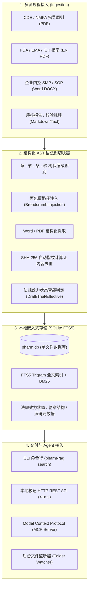

# Pharm-RAG 🧬⚖️

> **High-Fidelity Regulatory & SOP Precision Retrieval Engine for Biopharma CMC QA**  
> 专为生物制药（CGT、抗体、疫苗等）与药监法规、GMP/SOP 打造的高保真、零幻觉精确检索增强引擎。

[](https://github.com/molezz/Pharm-RAG/actions)
[](LICENSE)
[](https://www.rust-lang.org)
[](https://www.sqlite.org/fts5.html)

---

## 🌟 为什么需要 Pharm-RAG？（Why Pharm-RAG?）

在生物医药质量保证（QA）与药学研究（CMC）审查场景下，通用开源 RAG（如 Dify、RagFlow、AnythingLLM）存在以下致命缺陷：

| 评估维度 | 通用商业 / 开源 RAG | **Pharm-RAG (本引擎)** | 药企审核实际价值 |
| :--- | :--- | :--- | :--- |
| **切块逻辑** | 机械字符切块（如每 500 字一刀，法条经常被拦腰截断） | **按《章-节-条-款-项》法律语法树（AST）切分** | 完整保留整条法规语义与从属约束 |
| **证据追溯** | 返回孤立文本块，常遗漏具体规程出处 | **强挂载面包屑层级（Breadcrumbs）+ 页码** | 明确标明如 `《指南》> 第3章 > 第2节 > 第4条 [P.18]` |
| **法规效力区分** | 混淆草案与正式版，容易引用过期草案 | **法规生命周期四级管理 (现行/试行/征求意见稿/废止)** | 现行版优先召回；检索到草案强制红标警示，支持 `--only-effective` 纯合规检索 |
| **重复文件去重** | 重命名副本重复入库，导致搜索结果成倍冗余 | **基于 SHA-256 智能内容指纹去重** | 即使文件名不同（如 `指南.pdf` 与 `指南2026.pdf`），自动识别内容一致性并跳过 |
| **医药专有名词召回** | 通用分词器切碎词汇（如 `CAR-T`、`慢病毒`、`支原体`） | **SQLite FTS5 Trigram + 短词降级兜底** | 100% 逐字精确匹配，零检索盲区 |
| **响应速度与资源** | 需常驻庞大 Python 环境与外置向量库（数秒延迟，显存占用大） | **单二进制纯 Rust 编写，< 1ms 响应，内存 < 15MB** | AI Agent 批量调用数十次审查对比时毫无延迟感知 |
| **数据隐私** | 需配置繁琐数据库集群或依赖公有云 | **单文件 SQLite 本地存储（Local-first）** | 敏感未公开 SOP、偏差审计记录绝不外泄 |

---

## 🏗️ 核心架构（Architecture）



---

## ✨ 核心特性（Features）

- **单二进制零依赖（Single Binary）**：基于纯 Rust 编写，开箱即用，无需安装 Python、Node.js 或 Docker。
- **法规效力全生命周期管理（Regulatory Lifecycle）**：
  - 🟢 **`[现行正式版]`**：药监部门正式发布，最高法定效力；
  - 🟡 **`[试行版]`**：现行有效监管技术指导原则；
  - 🔴 **`[征求意见稿]`**：仅供审评趋势参考，检索时自动输出合规预警，支持 `--only-effective` 彻底屏蔽草案；
  - ⚪ **`[已废止/历史版本]`**：提供历史追溯。
- **SHA-256 智能内容去重（Deduplication）**：自动计算文件内容哈希。即使文件名被修改（如 `体外修饰.pdf` 与 `体外修饰-2026改名.pdf`），也能自动识别为同一文件并跳过重复录入，避免知识库污染。
- **逐字保真、零幻觉追溯**：每个返回的法规条目都带有完整的大纲层级面包屑和页码，作为法规审计判定的坚实底册。
- **生物医药专有 Trigram 检索**：完美适配中英文专有名词（如 `CAR-T`、`AAV`、`无菌检查`、`质粒`、`RCL`），长短词无缝降级兜底。
- **实时文件夹监控（Folder Watcher）**：一键开启守护，新放入的 PDF 或 DOCX 法规文档自动增量切块入库。
- **Agent 原生适配（MCP & REST API）**：内置标准 Model Context Protocol（MCP）Server，可直接作为工具挂载至 Hermes、Antigravity、Claude Code 等 AI 助手。
- **GitHub Actions 全平台预编译**：支持一键下载 Linux (x86_64/ARM64)、macOS (Apple Silicon/Intel) 及 Windows 原生可执行文件。

---

## 🚀 快速上手（Quick Start）

### 1. 安装方式

#### 方式 A：直接下载预编译二进制包（推荐）
从 [GitHub Releases](https://github.com/molezz/Pharm-RAG/releases) 页面下载对应操作系统的压缩包，解压后即可直接运行：
```bash
# 解压即可使用
tar -zxvf pharm-rag-linux-x86_64.tar.gz
chmod +x pharm-rag
./pharm-rag --help
```

#### 方式 B：从源码编译（需安装 Rust）
```bash
git clone https://github.com/molezz/Pharm-RAG.git
cd Pharm-RAG
cargo build --release
# 二进制文件位于 target/release/pharm-rag
```

---

### 2. 命令行常用操作

#### 📥 导入单篇或批量导入法规文档（支持自动去重）
```bash
# 导入单篇指导原则（自动识别征求意见稿/试行版/正式版）
pharm-rag ingest ./CDE-体外基因修饰系统药学研究与评价技术指导原则-202205.pdf

# 导入企业内部 SOP 规程 (Word)
pharm-rag ingest ./SOP-QC-2026-无菌检查操作规程.docx

# 批量扫描导入整个法规目录（自动识别重复文件并跳过）
pharm-rag ingest ./cgt_regulations/
```

#### 🔍 精确检索法条
```bash
# 常规精确检索（现行版自动优先排在前面，草案自动附加醒目标识与合规警示）
pharm-rag search "CAR-T 无菌检查"

# 严格合规模式：仅检索现行正式版与试行版，彻底过滤征求意见稿
pharm-rag search "RCL 检测" --only-effective

# 指定仅检索征求意见稿，了解药监审评最新风向
pharm-rag search "复制型病毒" --status draft

# 指定返回最多 3 条，并输出格式化 JSON 供下游代码解析
pharm-rag search "药学变更 控制" --limit 3 --json
```

#### 📊 查看法规库统计（含效力状态分类）
```bash
pharm-rag stats
```
输出示例：
```text
📊 Pharm-RAG 状态统计
─────────────────────────────
  数据库文件:     pharm.db
  已索引文档总数: 8
    ├─ 现行/试行版: 6
    └─ 征求意见稿: 2
  已切分法规条款: 303
─────────────────────────────
```

#### 👀 开启法规文件夹自动同步监听
```bash
# 只要将新法规 PDF/DOCX 丢进该文件夹，后台立即自动完成解析入库
pharm-rag watch ./incoming_regulations/
```

#### 🌐 启动本地极速 HTTP API & MCP Server
```bash
pharm-rag serve --port 8080
```
- **REST 检索接口**：`GET http://localhost:8080/api/v1/search?q=慢病毒滴度`
- **状态统计接口**：`GET http://localhost:8080/api/v1/stats`
- **MCP 服务端点**：`POST http://localhost:8080/mcp`（供 AI Agent 调用 `search_regulations` 工具）

---

## 🤖 接入 AI Agent（MCP 配置示例）

在你的 Agent 客户端（例如 Claude Desktop、Hermes 或 Antigravity）的 MCP 配置文件中添加：

```json
{
  "mcpServers": {
    "pharm-rag": {
      "command": "/path/to/pharm-rag",
      "args": ["serve", "--port", "8080"]
    }
  }
}
```
配置完成后，AI Agent 在执行 CMC 方案审查或变更定性时，会自动调用 `search_regulations` 获取 100% 准确的法条原文与条款编号！如果引述了草案，Agent 会收到明确的效力预警。

---

## 🗺️ 路线图（Roadmap）

- [x] 基于 Rust + SQLite FTS5 Trigram 的高保真检索核心
- [x] 章-节-条-款 面包屑 AST 树状切分器
- [x] 法规生命周期管理（现行/试行/征求意见稿三级区分与 `--only-effective` 过滤）
- [x] 基于 SHA-256 指纹的智能文档内容去重
- [x] Word (.docx) XML 原生高速解析
- [x] PDF 文本与分页信息提取
- [x] 文件夹增量自动监控 (`notify`)
- [x] 本地 HTTP REST API 与 Model Context Protocol (MCP) Server
- [x] GitHub Actions 多平台自动化矩阵编译构建与 Release 发布
- [ ] 复杂质控表格（Table-aware）Markdown 高保真对齐重构
- [ ] FDA / EMA 英文指南专有词根与中英双语检索支持
- [ ] 本地 ONNX 嵌入轻量 Hybrid 语义重排支持

---

## 📄 开源许可证（License）

本项目基于 [Apache-2.0 License](LICENSE) 协议开源。
欢迎生物制药领域的研发、CMC、QA、注册及 AI 开发者共同贡献与完善！
