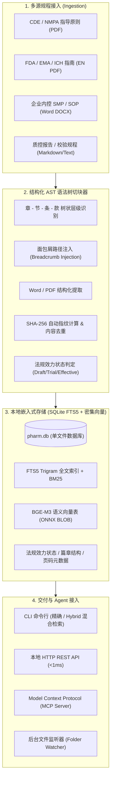

# Pharm-RAG 🧬⚖️

> **Pharmaceutical Regulatory and GxP SOP Retrieval Engine**  
> 医药行业药监法规与 GxP 规程检索工具。

[](https://github.com/molezz/Pharm-RAG/actions)
[](LICENSE)
[](https://www.rust-lang.org)
[](https://www.sqlite.org/fts5.html)

---

## 🌟 为什么需要 Pharm-RAG？（Why Pharm-RAG?）

在医药行业药学研究（CMC）与 GMP/GxP 规程检索场景下，通用 RAG 工具通常存在以下挑战：

| 评估维度 | 通用开源 / 商业 RAG | **Pharm-RAG (本引擎)** |
| :--- | :--- | :--- |
| **切块粒度** | 机械字符硬切（常截断法条） | **法律语法树（AST）切分**（章-节-条-款完整闭合） |
| **溯源能力** | 孤立片段，出处模糊 | **挂载大纲层级面包屑 + 原文页码** |
| **法规效力** | 草案与正式版混为一谈 | **四级生命周期管理**（现行/试行/征求意见稿清晰标识，可过滤草案） |
| **文件去重** | 重命名文件重复入库致结果冗余 | **SHA-256 内容指纹去重**（改名不重录） |
| **术语召回** | 分词截断专业缩写（如 CAR-T、RCL） | **FTS5 Trigram 逐字精准匹配**（< 1ms 响应） |
| **语义与双语** | 依赖外置向量库 / 仅支持单语 | **内置 BGE-M3 + RRF 混合检索**（中文语义直接检索 FDA 英文指南） |
| **数据安全** | 依赖云端或微服务组件 | **嵌入式 SQLite 单文件本地运行**（内控规程数据完全本地化） |

---

## 🏗️ 核心架构（Architecture）



---

## ✨ 核心特性（Features）

- **单二进制零依赖（Single Binary）**：基于 Rust 编写，开箱即用，无需安装 Python、Node.js 或 Docker。
- **本地 ONNX 跨语言 Hybrid 混合检索（BGE-M3 + RRF）**：内置多语言模型 BGE-M3，结合 Reciprocal Rank Fusion 算法将 Trigram 精确匹配与语义向量融合，支持中文语义检索 FDA/EMA 英文指南。
- **法规效力全生命周期管理（Regulatory Lifecycle）**：
  - 🟢 **`[现行正式版]`**：药监部门正式发布，法定生效标准；
  - 🟡 **`[试行版]`**：现行有效监管技术指导原则；
  - 🔴 **`[征求意见稿]`**：供审评趋势参考，检索时标注醒目标识，支持 `--only-effective` 过滤；
  - ⚪ **`[已废止/历史版本]`**：提供历史追溯。
- **SHA-256 智能内容去重（Deduplication）**：自动计算文件内容哈希。即使文件名被修改，也能识别为同一文件并跳过重复录入。
- **明确的篇章层级与来源追溯**：每个返回的法规条目均附带大纲层级面包屑和页码，便于核对原文。
- **医药专有名词 Trigram 检索**：适配中英文专有名词（如 CAR-T、AAV、无菌检查、质粒、RCL 等），长短词无缝降级兜底。
- **实时文件夹监控（Folder Watcher）**：新放入的 PDF 或 DOCX 法规文档自动增量切块入库。
- **Agent 原生适配（MCP & REST API）**：内置标准 Model Context Protocol（MCP）Server，可直接作为工具挂载至 Hermes、Antigravity、Claude 等 AI 助手。
- **GitHub Actions 全平台预编译**：支持一键下载 Linux (x86_64/ARM64)、macOS (Apple Silicon/Intel) 及 Windows 原生可执行文件。

---

## 🚀 快速上手（Quick Start）

### 1. 安装方式

#### 方式 A：直接下载预编译二进制包（推荐）
从 [GitHub Releases](https://github.com/molezz/Pharm-RAG/releases) 页面下载对应操作系统的压缩包，解压后即可直接运行：
```bash
# 解压即可使用
tar -zxvf pharm-rag-linux-x86_64.tar.gz
chmod +x pharm-rag
./pharm-rag --help
```

#### 方式 B：从源码编译（需安装 Rust）
```bash
git clone https://github.com/molezz/Pharm-RAG.git
cd Pharm-RAG
cargo build --release
# 二进制文件位于 target/release/pharm-rag
```

---

### 2. 命令行常用操作

#### 📥 导入单篇或批量导入法规文档（支持自动去重）
```bash
# 导入单篇指导原则（自动识别征求意见稿/试行版/正式版）
pharm-rag ingest ./CDE-体外基因修饰系统药学研究与评价技术指导原则-202205.pdf

# 导入企业内部 SOP 规程 (Word)
pharm-rag ingest ./SOP-QC-2026-无菌检查操作规程.docx

# 批量扫描导入整个法规目录（自动识别重复文件并跳过）
pharm-rag ingest ./cgt_regulations/
```

#### 🧠 生成与更新本地语义向量（BGE-M3 / ONNX Runtime）
```bash
# 自动下载并初始化多语言旗舰模型 BGE-M3，为库内法规条目生成密集向量
pharm-rag embed

# 可选：使用轻量版模型 BGE-Small-ZH（适合极低资源环境）
pharm-rag embed --small

# 可选：指定模型存放目录（默认自动保存在程序同级 ./models/ 目录）
pharm-rag embed --model-dir ./my_models/
```

#### 🔍 法规检索（支持 FTS5 Trigram 与 BGE-M3 混合检索）
```bash
# 1. 默认精确检索（Trigram 匹配医药专有名词）
pharm-rag search "CAR-T 无菌检查"

# 2. 跨语言语义混合检索（RRF 倒数排名融合，支持中文语义检索英文指南）
pharm-rag search "AAV 宿主细胞DNA残留限度" --hybrid --limit 3

# 3. 现行法规模式：仅检索现行正式版与试行版，过滤征求意见稿
pharm-rag search "RCL 检测" --only-effective

# 4. 指定仅检索征求意见稿，了解药监审评最新风向
pharm-rag search "复制型病毒" --status draft

# 5. 指定返回最多 3 条，并输出格式化 JSON 供下游代码或 Agent 解析
pharm-rag search "药学变更 控制" --limit 3 --json
```

#### 📊 查看法规库统计（含效力状态与向量覆盖率）
```bash
pharm-rag stats
```
输出示例：
```text
📊 Pharm-RAG 状态统计
─────────────────────────────
  数据库文件:     pharm.db
  已索引文档总数: 8
    ├─ 现行/试行版: 6
    └─ 征求意见稿: 2
  已切分法规条款: 303
  语义向量覆盖率: 303 / 303 (100.0%)
─────────────────────────────
```

#### 👀 开启法规文件夹自动同步监听
```bash
# 将新法规 PDF/DOCX 放入该文件夹，后台自动完成解析入库
pharm-rag watch ./incoming_regulations/
```

#### 🌐 启动本地 HTTP API & MCP Server
```bash
pharm-rag serve --port 8080
```
- **REST 检索接口**：`GET http://localhost:8080/api/v1/search?q=慢病毒滴度&hybrid=true`
- **状态统计接口**：`GET http://localhost:8080/api/v1/stats`
- **MCP 服务端点**：`POST http://localhost:8080/mcp`（供 AI Agent 调用 `search_regulations` 工具）

---

## 🤖 接入 AI Agent（MCP 配置示例）

### 1. 接入 Hermes Agent / Open-WebUI
在 Hermes 的 MCP 工具配置（或 `hermes_config.json`）中添加本地服务端点：

```json
{
  "mcp_servers": {
    "pharm_rag": {
      "url": "http://127.0.0.1:8080/mcp",
      "description": "Pharmaceutical Regulatory & GxP SOP Retrieval Engine"
    }
  }
}
```

### 2. 接入 Claude Desktop / Antigravity / Cursor
在客户端的 `mcp_settings.json` 中配置：

```json
{
  "mcpServers": {
    "pharm-rag": {
      "command": "/path/to/pharm-rag",
      "args": ["serve", "--port", "8080"]
    }
  }
}
```
配置完成后，AI Agent 在执行 CMC 方案审查、偏差调查或 GxP 合规性定性时，会自动调用 `search_regulations` 获取法条原文与条款编号。如果引述了草案，Agent 会收到明确的效力标识。

---

## 🗺️ 路线图（Roadmap）

- [x] 基于 Rust + SQLite FTS5 Trigram 的全文检索核心
- [x] 章-节-条-款 面包屑 AST 树状切分器
- [x] 法规生命周期管理（现行/试行/征求意见稿区分与 `--only-effective` 过滤）
- [x] 基于 SHA-256 指纹的文档内容去重
- [x] Word (.docx) XML 原生高速解析
- [x] PDF 文本与分页信息提取
- [x] 文件夹增量自动监控 (`notify`)
- [x] 本地 HTTP REST API 与 Model Context Protocol (MCP) Server
- [x] GitHub Actions 多平台自动化矩阵编译构建与 Release 发布
- [x] 本地 ONNX 嵌入轻量 Hybrid 语义重排支持（BGE-M3 + RRF 融合）
- [x] FDA / EMA 英文指南专有词根与中英双语检索支持
- [ ] 复杂质控表格（Table-aware）Markdown 对齐重构

---

## 📄 开源许可证（License）

本项目基于 [Apache-2.0 License](LICENSE) 协议开源。
欢迎医药领域的研发、CMC、质量管理与合规、注册及 AI 开发者共同贡献与完善！
